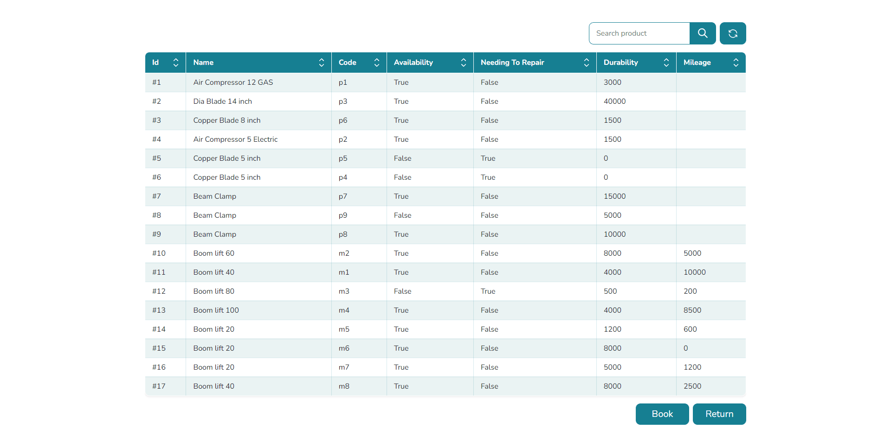

## &nbsp;

<h1 align="center">Rental App - React and Laravel</h1>

## Table of Contents

- [Table of Contents](#)
- [About](#about)
- [Prerequisites](#prerequisites)
- [Installing](#installing)
- [Third Party Dependencies](#third-party-dependencies)
- [Files And Directories Tree](#files-and-directories-tree)

## About

Simple rental app with react js and laravel.

## Prerequisites

- [Node : ^16.16.0](https://nodejs.org/en/download/)
- [npm : ^8.11.0](https://nodejs.org/en/download/)
- [Yarn : ^1.22.10](https://classic.yarnpkg.com/en/docs/install)
- [Git](https://git-scm.com/downloads)

## Installing

- Open terminal or command prompt

- Clone the project

  > ```bash
  > git clone https://github.com/meinjam/automation-task-react.git
  > cd automation-task-react
  > ```

- Install required libraries for project

> `npm install` \
> _or,_ \
> `yarn`

- Run the code after installing the libraries

> `npm start` \
> _or,_ \
> `yarn start`

_Note: Now this will run the app in the development mode and Open http://localhost:3000 to view it in the default browser._

- Create build file

> `npm run build` \
> _or,_ \
> `yarn build`

## Third Party Dependencies

- **_axios >= 0.27.2 :_** \
  _Axios is promise-based, which gives you the ability to take advantage of JavaScript’s async and await for more readable asynchronous code._

- **_bootstrap >= 5.2.0 :_** \
  _Axios is promise-based, which gives you the ability to take advantage of JavaScript’s async and await for more readable asynchronous code._

- **_react-bootstrap >= 2.5.0 :_** \
  _Axios is promise-based, which gives you the ability to take advantage of JavaScript’s async and await for more readable asynchronous code._

- **_react-loading-skeleton >= 3.1.0 :_** \
  _Axios is promise-based, which gives you the ability to take advantage of JavaScript’s async and await for more readable asynchronous code._

- **_react-toastify >= 9.0.8 :_** \
  _Axios is promise-based, which gives you the ability to take advantage of JavaScript’s async and await for more readable asynchronous code._

- **_sass >= 1.54.5 :_** \
  _Axios is promise-based, which gives you the ability to take advantage of JavaScript’s async and await for more readable asynchronous code._

## Files And Directories Tree

- **_public :_**\
  _Holds main index.html file._
- **_src :_** \
  _Holds js files which will be mostly edited._
  - **_App.js :_** \
    _Holds main Tasks page._
  - **_assets :_** \
    _Holds the static files like scss amd images._
    - **_scss :_**\
      _Holds the required scss for app._
    - **_img :_** \
      _Holds the required images for pages and components._
  - **_components :_** \
    _Holds all the component file regarding every page._
  - **_pages :_** \
    _Holds all the main page parent files._
    - **_Products.js :_**\
      _This is the main product page. Shows all the products. Product search, filter and book, return functionalities._
- **_{+ .env: +}_** \
  _{+ Holds the required API urls to fetch data from backend +}_
- **_.gitignore_**
- **_package.json_**
- **_package-lock.json_**
- **_README.md_**
